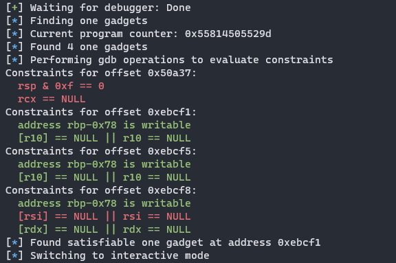
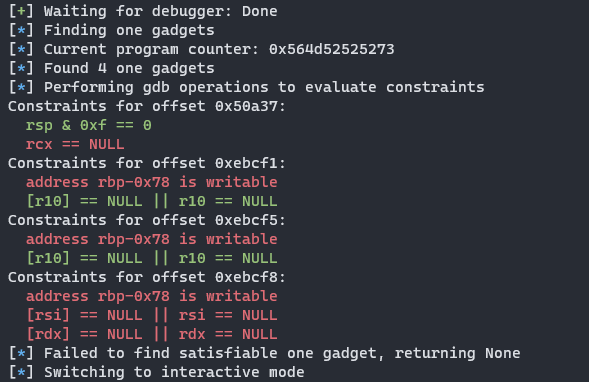

# pwn_gadget
Check for satisfied one gadget constraints using the state of a running gdb instance

# Installation
*Required* to have the [one_gadget](https://github.com/david942j/one_gadget) tool installed and in your path, it is called via subprocess to gather the gadgets/constraints
## Manual Install 
Installs pwn_gadget package for use in pwntools scripts and as a gdb command
```
git clone https://github.com/zolutal/pwn_gadget && \
pip install pwn_gadget/ && \
cp pwn_gadget/pwn_gadget.py ~/.pwn_gadget.py && echo "source ~/.pwn_gadget.py" >> ~/.gdbinit
```

## Installation from PyPi
Installs pwn_gadget package for use in pwntools scripts, will not setup gdb command
(also may be somewhat outdated)
```
pip install pwn-gadget
```


# How does this work?
pwn_gadget parses the constraints generated by [one_gadget](https://github.com/david942j/one_gadget) in python into a format that can be evaluated by a gdb `print` command.

Leveraging the Gdb python api, accessed through pwntools' gdb module, it executes those commands parsed from the one_gadget constraints.

Performs all of the boolean operations in the one_gadget constraints on the results from the commands run in gdb.

Searches for a gadget where every boolean operation returned True, returning either that offset or None.

Regardless of if a satisfiable gadget is found or not, color coded information on the succeeding and failing constraints for each gadget will be printed.

# Usage
## As a gdb command
```
(gdb) pwn_gadget ./libc.so.6
```

## In a pwntools script
```python
from pwn import *
import pwn_gadget

p = process("chal")
libc = p.libc

# attach and break at the target address
_, gdb_api = gdb.attach(p, gdbscript="b *(vuln+180)", api=True)
# call pwn_gadget function to look for satisfied gadgets
gadget = pwn_gadget.find_gadget(gdb_api, libc.path)

# use found address in payload
payload = b"A"*32 + p64(gadget+libc.address)
p.sendline(payload)

p.interactive()
```

# Example Output
## Success

## Failure


# TODOs
- The 'is writable' constraints are not to be trusted, the check for that isn't implemented yet
- Make gdb use case not dependent on pwntools, for some reason gdb uses system python (rip venv gang) 
- Cache the last satisfied gadget for remote exploits where getting a gdb instance isn't possible
- Some of the parsing done of the one_gadget command's output is very hackish, should test this against the example libcs in the one_gadget repo to make sure I didn't miss handling some possible constraints 
- Prevent using gdb command when there is no active process
- Have gdb command use the libc loaded by the process by default
- Might be out of scope, but for the pwntools use case it would be really cool to have an option which tries to auto-create a rop chain to satisfy simple constraints
